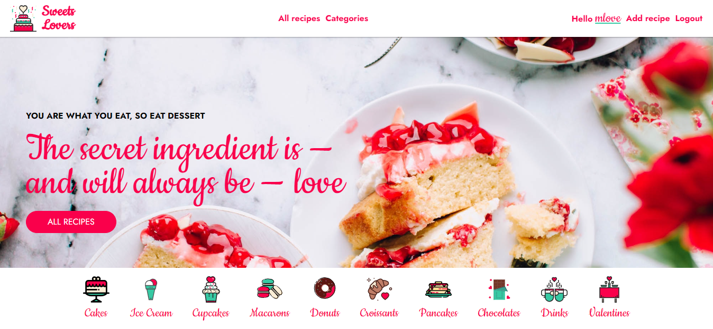

# Sweet Lovers React SPA

Welcome to the Sweet Lovers Recipe App! This is a web application that allows users to browse sweet recipes by categories and from the Spoonacular API, as well as create, edit, and like/dislike their own recipes.

## Table of Contents

- [Features](#features)
- [Technologies Used](#technologies-used)
- [Installation](#installation)
- [Routes](#routes)
- [Authentication](#authentication)
- [Extra Components](#extra-components)
  - [InputField](extra-components.md#Reusable-InputField-Component)
- [Contributing](#contributing)
- [License](#license)

## Features

This app allows users to browse a collection of sweet recipes and create and save their own recipes. Features include:

<!-- - Homepage displays hero section, categories and user recipes descending -->
- Browse all sweet recipes from users or/and Spoonacular API
- Browse recipes by category from all users or from Spoonacular API
- Create, edit and delete their personal recipes
- View recipe details, including ingredients and instructions
- Like and Dislike other users recipes

## Technologies Used

This app was built using the following technologies:

- React.js
- React Router Dom
- [React Icons](https://react-icons.github.io/react-icons/)
- [Spoonacular API](https://spoonacular.com/food-api)

## Installation

To install and run the app locally, follow these steps:

1. Clone the repository: `git clone https://github.com/MariaGeorgieva/recipes-react-app.git`
2. Install dependencies: `npm install`
3. Start the client by running `npm start` in the client directory
4. Open a browser and navigate to `http://localhost:3000`

To run server, follow these steps:

1.Clone the repository: `git clone https://github.com/softuni-practice-server/softuni-practice-server.git`
2.Start the server by running 'nodemon -e * index.js -dev' in the root server directory

## Routes

The Sweet Lovers Recipe App uses the following routes:

Public Routes

GET / - Returns the homepage of the app which displays categories and featured recipes from all users.
GET /recipes - Returns all sweet recipes from all users.
GET /recipes/:id - Returns details of the recipe with the specified id.
GET /categories/:category - Returns all sweet recipes from the specified category from Spoonacular API and from all users.
POST /login - Login page that allows users to login to their account.
POST /register - Register page that allows users to create a new account.

Private Routes

POST /recipes - Adds a new recipe to the database for the currently logged-in user.
PUT /recipes/:id - Edit the recipe with the specified id in the database for the currently logged-in user.
DELETE /recipes/:id - Deletes the recipe with the specified id from the database for the currently logged-in user.
GET /profile - Returns all created and liked recipes by the currently logged-in user.
POST /logout  - Logout page that allows users to logout from their account.
Note: Private routes are only accessible by registered and authenticated users.

## Authentication

### Register Fields Validation

To ensure that users enter valid information during the registration process, the following validation rules are applied:

Username: Must be unique and between 5 characters long.
Email: Must be a valid email address.
Password: Must be at least 6 characters long
Confirm Password: Must match the Password field.
If a user enters invalid information, an error message will be displayed on the registration page, and the form will not be submitted until all fields are valid.

### Login Fields Validation

To ensure that users enter valid information during the login process, the following validation rules are applied:

Username: Must be a valid username and at least 6 characters long.
Password: Must be a valid and at least 6 characters long
If a user enters invalid information, an error message will be displayed on the login page, and the form will not be submitted until all fields are valid.

These validation rules help to ensure that user data is accurate and secure, and they provide a better user experience by preventing users from entering incorrect information. Additionally, for security reasons, the application does not provide any indication of whether the email or password entered by the user was incorrect.

These validation rules help to ensure that user data is accurate and secure, and they provide a better user experience by preventing users from entering incorrect information.

## Extra Components

In addition to the main features of the Sweet Lovers Recipe App, the application also includes several extra components that enhance its functionality and user experience. These components include:

### Reusable InputField Component

The InputField component is a reusable input field that can be used for various form inputs such as text, number, and password. It includes validation for minimum input length and negative values.

### Reusable Dynamic Input Field Component

The dynamic input field allows users to easily add and edit ingredients and steps for their recipes. To add a new ingredient or step, the user can click the "Add Ingredient" or "Add Step" button, which will create a new input field for them to enter the necessary details.

For the ingredient input field, the user can enter the quantity and ingredient name.
For the steps input field, the user can enter the details for each step in the recipe.

To delete an ingredient or step, the user can click the "remove" button next to the corresponding input field.

These dynamic input fields make it easy for users to add and modify the ingredients and steps for their recipes, allowing them to share their favorite sweet treats with others in a user-friendly and intuitive way.

### Reusable Buttons Component

The reusable button component is a customizable button that can be used throughout the Sweet Lovers Recipe App. It includes several props that can be adjusted to fit the needs of the application.

Props
text: The text displayed on the button.
onClick: A function that is called when the button is clicked.

### Reusable Textarea Component

The reusable textarea component can be used throughout the app for input fields that require larger blocks of text, such as recipe descriptions or comments. The component takes in the following props:

- `name` (required): A string representing the name of the textarea input.
- `value` (required): A string representing the current value of the textarea input.
- `onChange` (required): A function that is called whenever the value of the textarea input changes.
- `label` (optional): A string representing the label for the textarea input.
- `rows` (optional): An integer representing the number of rows for the textarea input.
- `cols` (optional): An integer representing the number of cols for the textarea input.

### Reusable Select Component

The Select component is a reusable component that allows the user to select an option from a dropdown list. The Select component takes in the following props:

label: the label for the select field
value: the current value of the select field
options: an array of objects representing the options in the dropdown list, each object has two properties: value and label
name: the name attribute for the select field
onChangeHandler: a callback function to handle changes to the select field value

### Error Boundary

The error boundary component helps to ensure that the application continues to function even if an error occurs. If an error is detected within a component, the error boundary displays a friendly error message to the user, rather than crashing the entire application.

These extra components enhance the functionality and user experience of the Sweet Lovers Recipe App, making it a more user-friendly and robust application.

## Contributing

To contribute to the project, follow these steps:

1. Fork the project
2. Create a new branch: `git checkout -b feature-name`
3. Make your changes and commit them: `git commit -m 'Add some feature'`
4. Push to the branch: `git push origin feature-name`
5. Submit a pull request

## License

This project is licensed under the [MIT License](https://opensource.org/licenses/MIT).
